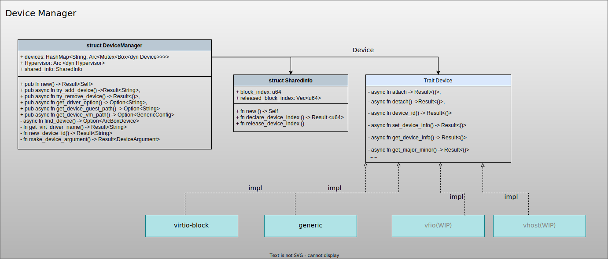

# Multi-vmm support for runtime-rs

## 0. Status

External hypervisor support is currently being developed.

See [the main tracking issue](https://github.com/kata-containers/kata-containers/issues/4634)
for further details.

### Cloud Hypervisor

A basic implementation currently exists for Cloud Hypervisor. However,
since it is not yet fully functional, the feature is disabled by
default. When the implementation matures, the feature will be enabled
by default.

> **Note:**
>
> To enable the feature, follow the instructions on https://github.com/kata-containers/kata-containers/pull/6201.

See the [Cloud Hypervisor tracking issue](https://github.com/kata-containers/kata-containers/issues/6263)
for further details.

Some key points for supporting multi-vmm in rust runtime.
## 1. Hypervisor Config

The diagram below gives an overview for the hypervisor config


VMM's config info will be loaded when initialize the runtime instance, there are some important functions need to be focused on. 
### `VirtContainer::init()`

This function initialize the runtime handler. It will register the plugins into the HYPERVISOR_PLUGINS. Different plugins are needed for different hypervisors. 
```rust
#[async_trait]
impl RuntimeHandler for VirtContainer {
    fn init() -> Result<()> {
        // register
        let dragonball_config = Arc::new(DragonballConfig::new());
        register_hypervisor_plugin("dragonball", dragonball_config);
        Ok(())
    }
}
```

[This is the plugin method for QEMU. Other VMM plugin methods haven't support currently.](../../../libs/kata-types/src/config/hypervisor/qemu.rs)
QEMU plugin defines the methods to adjust and validate the hypervisor config file, those methods could be modified if it is needed.

After that, when loading the TOML config, the plugins will be called to adjust and validate the config file.
```rust
async fn try_init(&mut self, spec: &oci::Spec) -> Result<()> {、
    ...
    let config = load_config(spec).context("load config")?;
    ...
}
```

### new_instance

This function will create a runtime_instance which include the operations for container and sandbox.  At the same time, a hypervisor instance will be created.  QEMU instance will be created here as well, and set the hypervisor config file
```rust
async fn new_hypervisor(toml_config: &TomlConfig) -> Result<Arc<dyn Hypervisor>> {
    let hypervisor_name = &toml_config.runtime.hypervisor_name;
    let hypervisor_config = toml_config
        .hypervisor
        .get(hypervisor_name)
        .ok_or_else(|| anyhow!("failed to get hypervisor for {}", &hypervisor_name))
        .context("get hypervisor")?;

    // TODO: support other hypervisor
    match hypervisor_name.as_str() {
        HYPERVISOR_DRAGONBALL => {
            let mut hypervisor = Dragonball::new();
            hypervisor
                .set_hypervisor_config(hypervisor_config.clone())
                .await;
            Ok(Arc::new(hypervisor))
        }
        _ => Err(anyhow!("Unsupported hypervisor {}", &hypervisor_name)),
    }
}
```

## 2. Hypervisor Trait

[To support multi-vmm, the hypervisor trait need to be implemented.](./src/lib.rs)
```rust
pub trait Hypervisor: Send + Sync {
    // vm manager
    async fn prepare_vm(&self, id: &str, netns: Option<String>) -> Result<()>;
    async fn start_vm(&self, timeout: i32) -> Result<()>;
    async fn stop_vm(&self) -> Result<()>;
    async fn pause_vm(&self) -> Result<()>;
    async fn save_vm(&self) -> Result<()>;
    async fn resume_vm(&self) -> Result<()>;
    
    // device manager
    async fn add_device(&self, device: device::Device) -> Result<()>;
    async fn remove_device(&self, device: device::Device) -> Result<()>;
    
    // utils
    async fn get_agent_socket(&self) -> Result<String>;
    async fn disconnect(&self);
    async fn hypervisor_config(&self) -> HypervisorConfig;
    async fn get_thread_ids(&self) -> Result<VcpuThreadIds>;
    async fn get_pids(&self) -> Result<Vec<u32>>;
    async fn cleanup(&self) -> Result<()>;
    async fn check(&self) -> Result<()>;
    async fn get_jailer_root(&self) -> Result<String>;
    async fn save_state(&self) -> Result<HypervisorState>;
   }
```
In current design, VM will be started in the following steps.


## 3. Hypervisor Devices
The device Manager is responsible for handling the hypervisor's devices. 

Within the `struct`, there are three major components:
* devices is a hash map that stores all of the devices that have already been attached to the VM
* hypervisor offers functionalities for attaching devices
* shared_info is used to hold the hypervisor's global variables, such as the current block index and the index that has already been released

The device manager will provide the following public methods to other `crate`:
* `try_add_device` will try to attach the device into the hypervisor
* `try_remove_device` will try to remove the device from the hypervisor
* `get_driver_option`, `get_device_guest_path` , and `get_device_vm_path` could provide some detail information about the device in the guest, and those information will be provided to the agent for further operation in the guest



For different kind of devices operation, the specific device will implement this trait. Currently, virtio-block device has been implemented, and we plan to enable `Vfio` device and vhost-user device in the future.
```rust
#[async_trait]
pub trait Device: Send + Sync {
    // attach is to plug block device into VM
    async fn attach(&mut self, h: &dyn hypervisor, da: DeviceArgument) -> Result<()>;
    // detach is to unplug block device from VM
    async fn detach(&mut self, h: &dyn hypervisor) -> Result<Option<u64>>;
    // device_id returns device ID
    async fn device_id(&self) -> &str;
    // set_device_info set the device info
    async fn set_device_info(&mut self, device_info: GenericConfig) -> Result<()>;
    // get_device_info returns device config
    async fn get_device_info(&self) -> Result<GenericConfig>;
    // get_major_minor returns device major and minor numbers
    async fn get_major_minor(&self) -> (i64, i64);
    // get_host_path return the device path in the host
    async fn get_host_path(&self) -> &str;
    // get the bus device function id of device
    async fn get_bdf(&self) -> Option<String>;
    // get the virt path of the device
    async fn get_virt_path(&self) -> Option<String>;
    // get_attach_count returns how many times the device has been attached
    async fn get_attach_count(&self) -> u64;
    // increase_attach_count is used to increase the attach count for a device
    // return values:
    // * skip bool: no need to do real attach when current attach count is zero, skip following actions.
    // * err error: error while do increase attach count
    async fn increase_attach_count(&mut self) -> Result<bool>;
    // decrease_attach_count is used to decrease the attach count for a device
    // return values:
    // * skip bool: no need to do real dettach when current attach count is not zero, skip following actions.
    // * err error: error while do decrease attach count
    async fn decrease_attach_count(&mut self) -> Result<bool>;
    // get the device driver type
    async fn device_driver(&self) -> Option<String>;
    // get the device guest path
    async fn get_device_guest_path(&self) -> Option<String>;
    // get the device vm path
    async fn get_device_vm_path(&self) -> Option<String>;
}
```